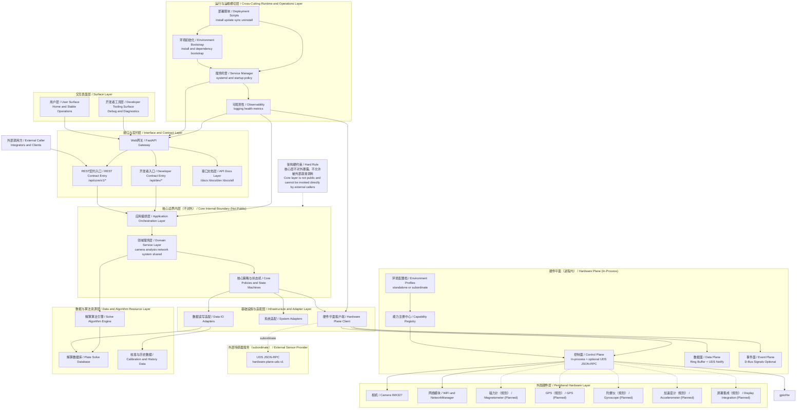

# OGScope System Architecture (Bilingual)

> 本文档给出 OGScope 的“系统级”架构视图（区别于 API 路由分层），强调核心边界、用户层与开发者工具层隔离、运维层横切属性，以及 hardware plane 与 subordinate 集成边界。  
> This document provides OGScope system-level architecture (different from API route layering), emphasizing core boundary, user/developer surface separation, cross-cutting operations, and hardware-plane / subordinate integration boundaries.

## Architecture Diagram / 架构图

## Key Clarifications / 关键说明

- **FastAPI is not core / FastAPI 不是核心层**  
`webGateway` 属于接口网关层，核心业务位于 `appLayer/domainLayer/corePolicy`。
- **Core cannot be called directly / 核心层禁止外部直调**  
外部调用方必须经 `REST Contract Entry`（`/api/core/v1/*`），不能直接调用核心模块。
- **Developer tooling is not user surface / 开发者工具层不等于用户层**  
`userSurface` 与 `devSurface` 分层，路径、权限和稳定性承诺都应分离。
- **Solve data is not peripheral hardware / 解算数据不属于外围硬件**  
`Plate Solve Database` 被归入“数据与算法资源层”，与实体硬件层解耦。
- **Runtime/Ops is cross-cutting / 运维层是横切层**  
运维能力同时作用于网关层、核心层和基础设施层，不是单一依赖于接口层。
- **Hardware plane profiles / 硬件平面配置档**  
通过 `OGSCOPE_HARDWARE_PLANE_ROLE` 在 `standalone` 与 `subordinate` 间切换；详见 [subordinate-mode](../contracts/subordinate-mode.md)。
- **Registerable capabilities / 能力可注册**  
传感器与人机交互硬件通过 `Capability Registry` 管理，支持不同环境装配不同驱动逻辑。
- **Unified hardware contract / 统一硬件契约**  
OGScope 通过 `Hardware Plane Client` 使用统一能力接口（status/read/command/subscribe）。
- **Subordinate integration boundary / subordinate 集成边界**  
在 `subordinate` 角色下，上层集成方业务协作走 `REST /api/core/v1/*`；传感器读请求通过本机 `UDS JSON-RPC` 委托给外部提供方（[hardware-plane-uds-v1](../contracts/hardware-plane-uds-v1.md)）。本地传感器/HMI 默认禁用，相机仍由 OGScope 维护。
