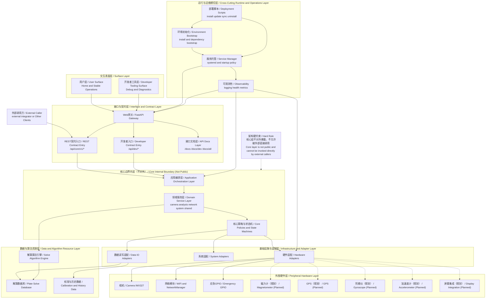

# OGScope System Architecture (Bilingual)

> 本文档给出 OGScope 的“系统级”架构视图（区别于 API 路由分层），强调核心边界、用户层与开发者工具层隔离、以及运维层的横切属性。  
> This document provides the system-level architecture view of OGScope (different from API route layering), emphasizing core boundary, separation between user and developer surfaces, and the cross-cutting nature of operations.

## Architecture Diagram / 架构图

## Key Clarifications / 关键说明

- **FastAPI is not core / FastAPI 不是核心层**  
`webGateway` 属于接口网关层，核心业务位于 `appLayer/domainLayer/corePolicy`。
- **Core cannot be called directly / 核心层禁止外部直调**  
外部调用方（含 external integrator）必须经 `REST Contract Entry`，不能直接调用核心模块。
- **Developer tooling is not user surface / 开发者工具层不等于用户层**  
`userSurface` 与 `devSurface` 分层，路径、权限和稳定性承诺都应分离。
- **Solve data is not peripheral hardware / 解算数据不属于外围硬件**  
`Plate Solve Database` 被归入“数据与算法资源层”，与实体硬件层解耦。
- **Runtime/Ops is cross-cutting / 运维层是横切层**  
运维能力同时作用于网关层、核心层和基础设施层，不是单一依赖于接口层。

